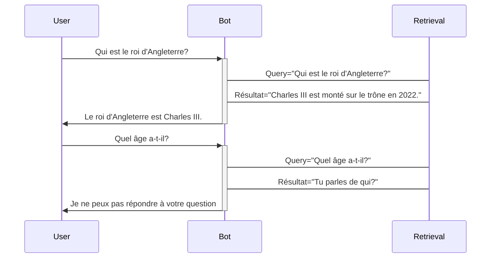
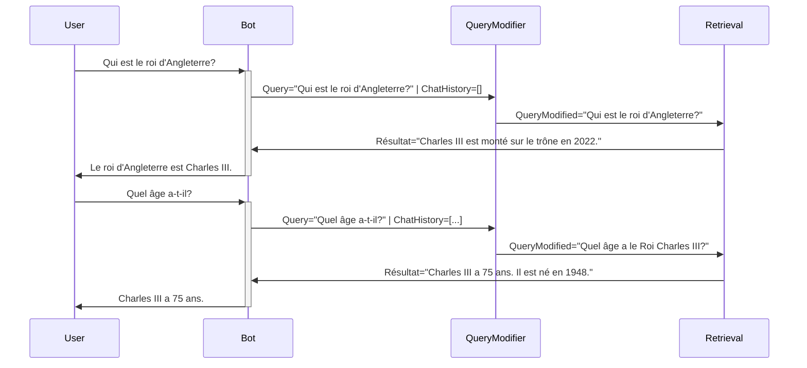

# Découverte du RAG

Retrieval Augmented Generation

---
layout: default
---

# Sommaire

<Toc maxDepth="1"></Toc>

---

# Qui suis-je

## Victor Santelé

Étudiant à Unamur en informatique à finalité Data Science

- Ancien étudiant en IG à l'Henallux
- Dev autodidacte depuis une dizaine d'année
- Ancien stagiaire du MIC (2022)
- 6x Azure Certified
- Fan de serverless

**Contact:**

Twitter: [@vsantele](https://x.com/vsantele) <br>
LinkedIn: [Victor Santelé](https://www.linkedin.com/in/victor-santele/)

---

# Définition

## RAG (Retrieval Augmented Generation)

- Technique de grounding
- Design pattern d'IA Generative
- Combine LLM et sources de données externes
- Utilise (souvent) une DB vectorielle 
- Permet de générer des réponses plus précises
- Plus simple et moins chère que le fine-tuning

---

# Exemple

<div class="grid grid-flow-col grid-rows-1 grid-cols-3 gap-4">
  <div class="col-span-1 flex items-center">
    <div>
      <p class="font-bold">Copilot Chat </p>
      <p>Utilise le contenu de la page pour améliorer son contexte et sa précision.</p>
    </div>
  </div>
  <div class="col-span-2">
    
  </div>
</div>

---

# Concrètement

- Besoin de données structurées ou non structurées
- Utilisation de DB vectorielle
- Embedding des documents
- Embedding des requêtes
- Recherche des plus proches voisins
- Utilisation des plus proches voisins pour améliorer la génération

---

<div class="w-full h-full">
  
</div>

---

# Embedding

- Utilisation de modèles de langage pour transformer les données en vecteurs
- Permet de garder la sémantique du texte
- Permet de faire des recherches rapides avec un autre vecteur
- Plusieurs use-cases: recherche, clustering, classification, recommendations, détection d'anomalies, ...

<br>
<br>
<br>
<br>
<br>

Le plus connu: `text-embedding-ada-002` <br>
Nouveau: `text-embedding-3-small` et `text-embedding-3-large` <br>
Local: [`all-MiniLM-L6-v2`](https://huggingface.co/sentence-transformers/all-MiniLM-L6-v2) <br>
Classement: <https://huggingface.co/spaces/mteb/leaderboard>

Documentation: <https://platform.openai.com/docs/guides/embeddings/use-cases>

---

# Base de données vectorielle

- Optimiser pour le stockage et la recherche de vecteurs
- Permet de stocker n'importe quel type de vecteurs
- Plusieurs méthodes: FAISS, Pinecone, QDrant, CosmosDB (MongoDb vCore et Postgres)
- Recherche via graph, arbre ou hash (pour info)


Documentation: [https://learn.microsoft.com/en-us/azure/cosmos-db/vector-database](https://learn.microsoft.com/en-us/azure/cosmos-db/vector-database?wt.mc_id=studentamb_236461)

---

# Service tout en 1

## Azure Ai Search

- Full-text search
- Vector similarity search
- Facilité d'accès granulaire
- Facile d'utilisation

<br>
<br>
<br>
<br>

Liste des features: [https://learn.microsoft.com/en-us/azure/search/search-features-list](https://learn.microsoft.com/en-us/azure/search/search-features-list?wt.mc_id=studentamb_236461)

---
layout: section
---

# Retrieval

Comment retrouver les documents pertinents?

---

## Contexte

Exemple simple de discution à un chatbot.

- **User**: Qui est le roi d'Angleterre?
- **Bot**: Le roi d'Angleterre est Charles III.
- **User**: Quel âge a-t-il?
- **Bot**: Charles III a 75 ans.

---



---



---

## Query Modifier?

_(J'ai pas trouvé mieux)_

On utilise un LLM pour modifier la requête de l'utilisateur pour qu'elle soit plus précise et compréhensible sans autre contexte.

---
level: 2
---

## Méthode avancée 1: Rag-Fusion

- Demander plusieurs requêtes sur base de la nouvelle question de l'utilisateur et de l'historique.
- Faire les requêtes pour toutes celles générées.
- Rerank les documents via un algo "Reciprocal Rank Fusion"
- Utiliser les k meilleurs dans le contexte.

Exemple: 

"Quand faire pousser un oliver?"

-> "Quand planter un olivier?"<br>
-> "Quel est le meilleur moment pour planter un olivier?"<br>
-> "Quel période de l'année pour planter un oliver?"<br>

Source: <https://github.com/Raudaschl/rag-fusion>

---
level: 3
transition: slide-up
---

### Reciprocal Rank Fusion
<br>
<br>

$$
RRFscore(d \in D) = \sum_{r \in R} \frac{1}{k + r(d)}
$$

<br>
<br>

D: Documents <br>
R: Rangs <br>
k: constante = 60 <br>
r(d): rang du document d <br>

---

Autrement dit:

```python{all|1-5|6|8|9-11|10|12-13|14|all}
search_results_dict = {
    "query1": {"doc1": 0.5, "doc2": 0.3, "doc3": 0.2},
    "query2": {"doc1": 0.4, "doc2": 0.3, "doc3": 0.3},
    "query3": {"doc1": 0.6, "doc2": 0.2, "doc3": 0.2},
}
fused_scores = {}

for query, doc_scores in search_results_dict.items():
    for rank, (doc, score) in enumerate(
        sorted(doc_scores.items(), key=lambda x: x[1], reverse=True)
    ):
        if doc not in fused_scores:
            fused_scores[doc] = 0
        fused_scores[doc] += 1 / (rank + k)
```

<!--
1: all
2: search_results_dict
3: fused_scores
4: for query
5: for rank
6: doc_scores sorted
7: calcul
-->
---

## Méthode avancée 2:  Multi-Hop Reasoning System 

<div v-click class="italic">
j'y ai pensé avant de voir que  ça existait...
</div>
<br>
- Décomposer la question en plusieurs sous-questions qui se suivent/ sont complémentaires.
- Faire les requêtes pour toutes les décompositions.
- Utiliser les résultats pour répondre à la question initiale.

<br>
Exemple: 

"Quel âge a le roi d'angleterre?" <br>
-> "Qui est le roi d'angleterre en 2024?" <br>
\[On récupère la réponse\] <br>
-> "Quand est née X" <br>
\[On récupère la réponse\] <br>
-> Calcul de l'âge <br>

---

Autre exemple:

- Recherche dans des textes de lois
- Références à d'autres articles
- Combinaison de plusieurs sources pour une réponse

---

### Piste de recherche

- Entity Extraction
- Question Decomposition
- Multihop QA System

---

# Conclusions

## Warning

- Ne pas se reposer uniquement sur les LLMs
- Explorer des techniques "classiques", NLP, ML, ...

## Mots clés
  
- RAG
- LLM
- DB vectorielle
- Embedding 
- Rag-Fusion
- Multi-Hop Reasoning
- NLP 
- Entity Extraction

---

# Documentation

- [https://techcommunity.microsoft.com/t5/fasttrack-for-azure/grounding-llms/ba-p/3843857](https://techcommunity.microsoft.com/t5/fasttrack-for-azure/grounding-llms/ba-p/3843857?wt.mc_id=studentamb_236461)
- <https://www.linkedin.com/pulse/retrieval-augmented-generation-rag-next-frontier-covarrubias/>
- <https://medium.com/@shivansh.kaushik/this-technique-will-make-your-llm-smarter-and-more-context-aware-rag-on-steroids-b16d7cf4a42c>
- <https://medium.com/@shivansh.kaushik/talk-to-your-database-using-rag-and-llms-42eb852d2a3c>

## Culture générale

- Début du RAG: <https://ai.meta.com/blog/retrieval-augmented-generation-streamlining-the-creation-of-intelligent-natural-language-processing-models/>
- Explications des techniques dans FAISS: <https://www.pinecone.io/learn/series/faiss/>

